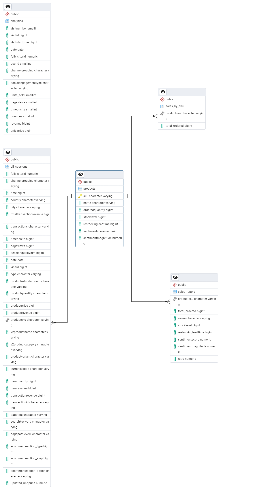

# Final-Project-Transforming-and-Analyzing-Data-with-SQL

## Project/Goals
The goal of this project is to provide data driven insight to a company to help maximize sales and profit.

## Process
1. Data Normalization and cleaning.
2. Created a database on postgreSQL, assigned the appropriate datatypes for the different columns, and used the CSV files to populate the tables in the database.
3. Identified primary and foreign keys for the different tables using various cleaning techniques.
4. Aggregation of data by countries, cities, products and product categories, to drive insight.

## Results
From the analysis, the USA is a strong market for this company and drives a huge percentage of the company's revenue.

### Schema

Schema and other result images can be found in the OUTPUTS folder.

## Challenges 
Lots of missing values in the database and the different tables are not already connected with private and foreign keys. Alot of this was addressed in the data cleaning process in order to answer the assigned questions.

## Future Goals
Recommendations for further analysis and research would be traffic sources that led viewers to the site in the first place as well as analysis of age range of customers who made the purchases.
